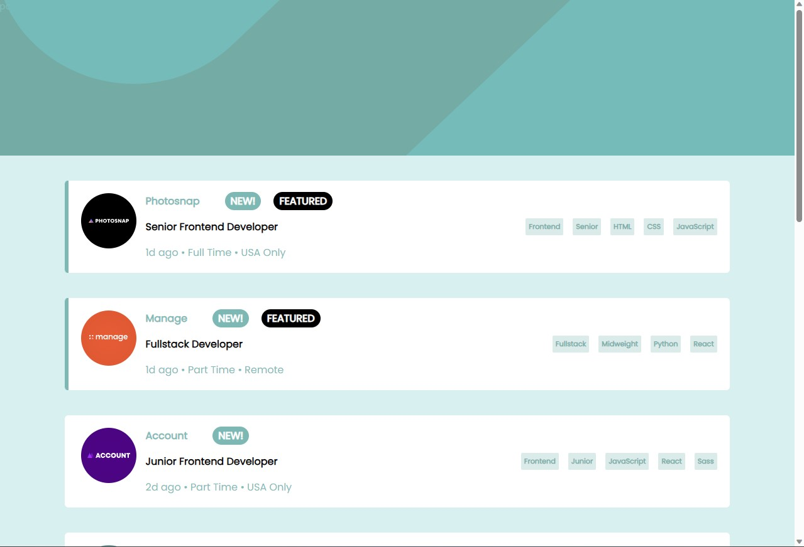
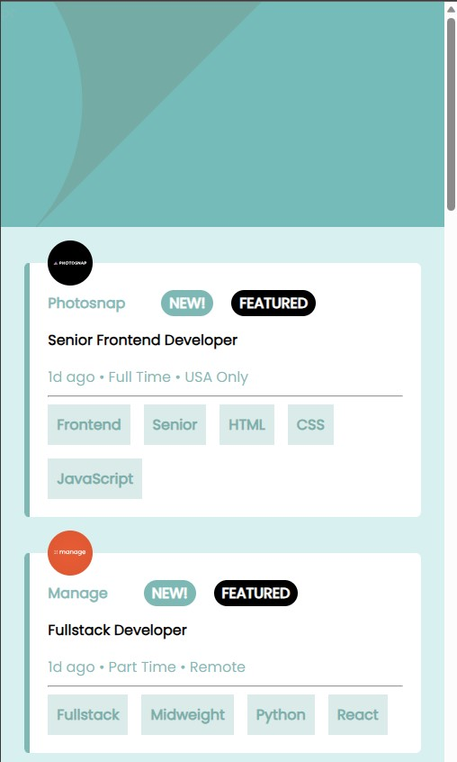
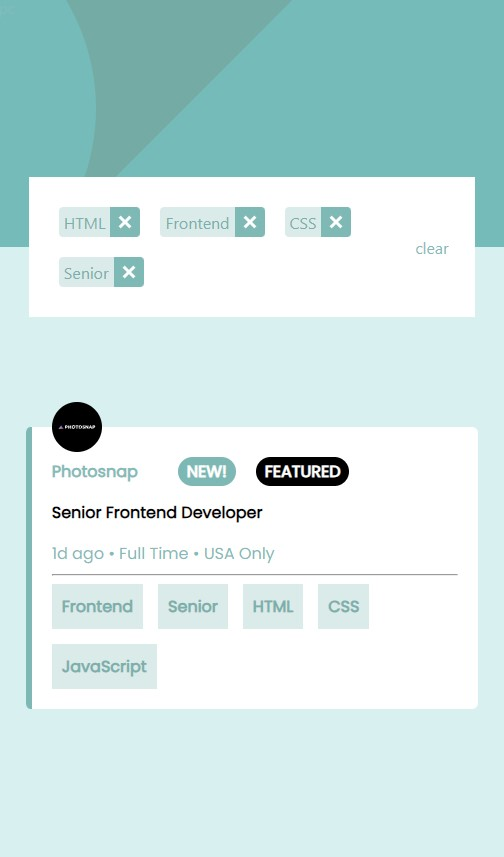
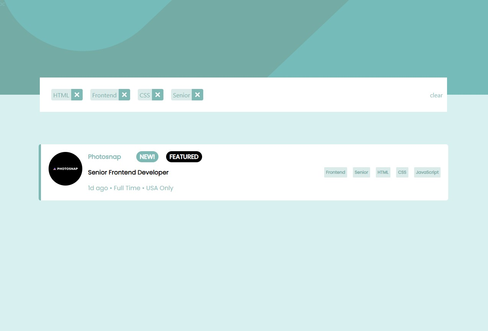

# Frontend Mentor - Job listings with filtering solution

This is a solution to the [Job listings with filtering challenge on Frontend Mentor](https://www.frontendmentor.io/challenges/job-listings-with-filtering-ivstIPCt). Frontend Mentor challenges help you improve your coding skills by building realistic projects. 

## Table of contents

- [Frontend Mentor - Job listings with filtering solution](#frontend-mentor---job-listings-with-filtering-solution)
  - [Table of contents](#table-of-contents)
    - [The challenge](#the-challenge)
    - [Screenshot](#screenshot)
    - [Links](#links)
    - [Built with](#built-with)
    - [What I learned](#what-i-learned)
    - [Useful resources](#useful-resources)
  - [Author](#author)


### The challenge

Users should be able to:

- View the optimal layout for the site depending on their device's screen size
- See hover states for all interactive elements on the page
- Filter job listings based on the categories


### Screenshot






### Links

- Solution URL: [solution URL is here](https://mohamedA122ouz.github.io/jobList)
- Live Site URL: [live site URL is here](https://github.com/mohamedA122ouz/jobList)


### Built with

- Semantic HTML5 markup
- CSS custom properties
- Flexbox
- Mobile-first workflow
- [React](https://reactjs.org/) - JS library
- [Scss](https://sass-lang.com/documentation/)

### What I learned

I learned how to use Scss and its features, such as nested selectors, variables, mixins, and more. I also learned how to use Scss selectors, such as & and #{&}, to simplify and optimize my code.

Example:
``` scss
@mixin centerElement(){
  transform:translate(-50%,-50%);
  position:absolute;
  left:50%;
  top:50%;
}
$containerWidth:80%;
body{
  .container{
    @include centerElement();
    width:$containerWidth;
    .centeredElment{
      @include centerElement();
      width:$containerWidth/2;
    }
  }
}
```


### Useful resources

- [React](https://react.dev/) - learn react from scratch.
- [Scss](https://sass-lang.com/documentation/)

## Author

- Website - [@mohamed ahmed azouz](https://mohameda122ouz.github.io/coursera-work/RAAM)
- Frontend Mentor - [@mohamed ahmed azouz](https://www.frontendmentor.io/profile/mohamedA122ouz)

